## Pertanyaan Praktikum

1. Adakah error ketika terjadi kesalahan penulisan tag?: Tidak

2. Apa perbedaan tag `<p>` dengan `<br>`?: 
---> P untuk Paragraf da BR untuk line break, atau membuat jarak line baru

3. Apa perbedaan atribut `title` dan `alt` pada tag ``?:

- alt (alternative text): Memberikan deskripsi gambar dan berfungsi sebagai teks alternatif jika gambar tidak dapat ditampilkan.
- title: Menampilkan informasi tambahan atau judul gambar saat pengguna menyorot gambar dengan kursor mouse.

4. Agar proporsional, sebaiknya atribut width dan height diisi semua atau tidak? Jelaskan.: Sebaiknya di isi agar ukuran konsisten, dan sesuai yang kita inginkan

5. Apa perbedaan atribut `target` dengan nilai `_blank`, `_self`, `_top`, dan `_parent`?:

- \_blank: Membuka halaman di tab atau jendela baru.
- \_self: Membuka halaman di konteks penelusuran yang sama (tab/jendela yang sama).
- \_top: Membuka halaman di halaman teratas, sepenuhnya mengabaikan semua bingkai yang ada.
- \_parent: Membuka halaman di konteks penelusuran induk; jika tidak ada induk, berfungsi seperti \_self.

---

# Praktikum 1 – HTML Dasar

Nama : Leni

NIM : 312410442

Kelas : TI.24.A5

## 📂 Struktur Repository

```

Lab1Web/
│
├── lab1\_tag\_dasar.html
├── lab1\_halaman2.html
├── LogoUPB.jpg
└── README.md

```

## 🚀 Langkah-langkah Praktikum

### 1️⃣ Membuat File HTML Dasar

Buat file baru bernama **`lab1_tag_dasar.html`** dan tuliskan struktur dasar HTML:

```html
<!DOCTYPE html>
<html>
  <head>
    <title>Lab 1 – HTML Dasar</title>
  </head>
  <body>
  
  </body>
</html>
```

📸 **Screenshot VSCode & Browser**

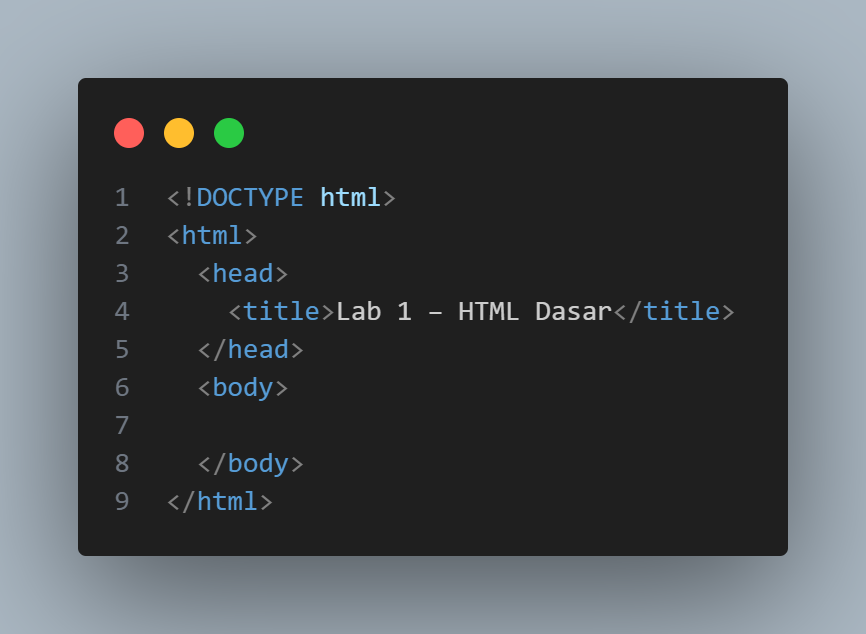

<br>

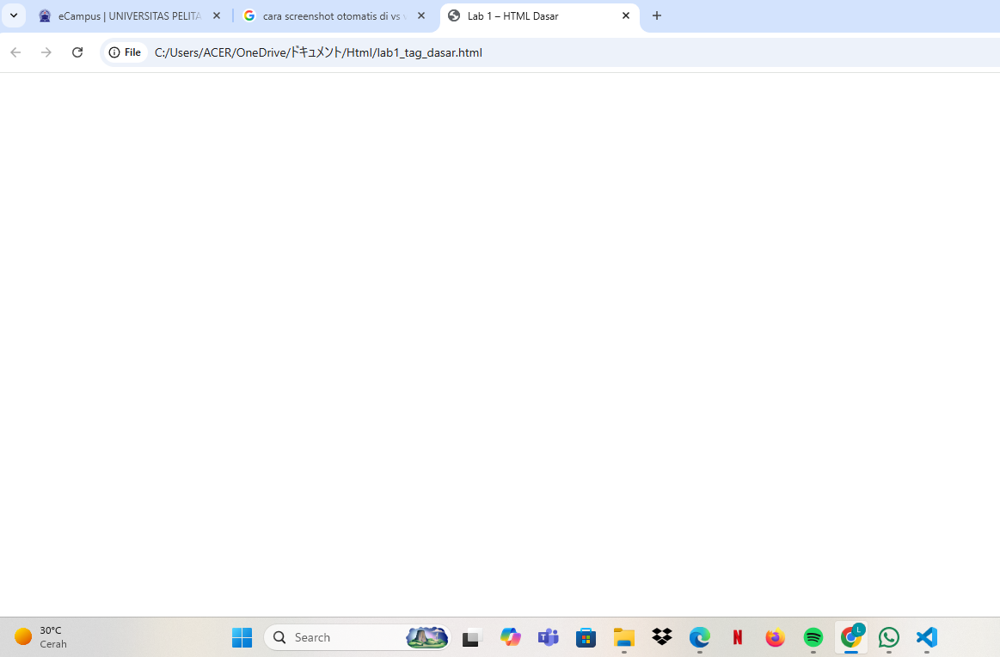

---

### 2️⃣ Membuat Paragraf

Tambahkan paragraf ke dalam body HTML:

```html
<!-- Ini adalah paragraf pertama -->
<p>Kami sedang belajar HTML dasar...</p>

<!-- Ini adalah paragraf kedua -->
<p>Ini merupakan sebuah paragraf yang terdiri dari beberapa kalimat...</p>
```

📸 **Screenshot Paragraf pada Browser**

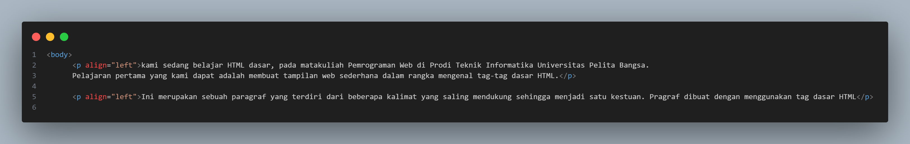

<br>

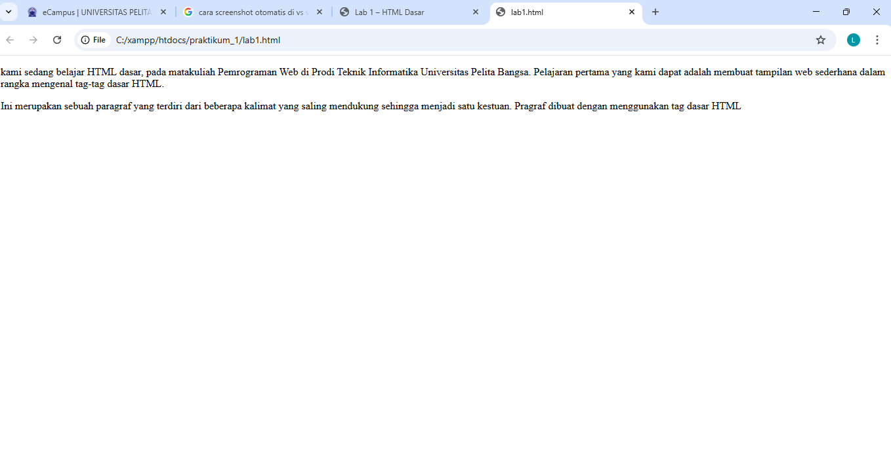

---

### 3️⃣ Menambahkan Judul

Tambahkan heading **h1** dan **h2** sebelum paragraf:

```html
<!-- judul paragraf pertama -->
<h1>Belajar Dasar HTML</h1>

<!-- judul paragraf kedua -->
<h2>Paragraf pada HTML</h2>
```

📸 **Screenshot Tampilan Judul**

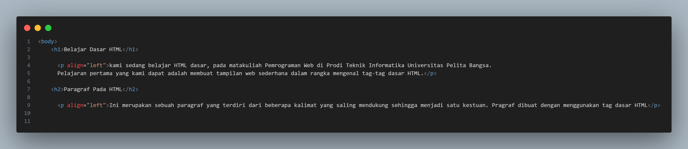

<br>

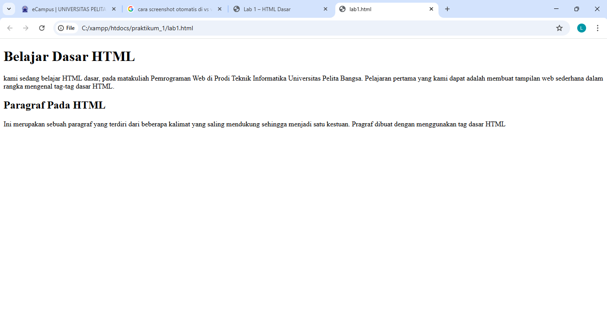

---

### 4️⃣ Memformat Teks

Lakukan pemformatan teks pada paragraf, misalnya:

```html
<p align="center"><b>Teks ini tebal</b> dan <i>teks ini miring</i></p>
<p align="right">Ini adalah <sub>subscript</sub> dan <sup>superscript</sup></p>
```

📸 **Screenshot Pemformatan Teks**

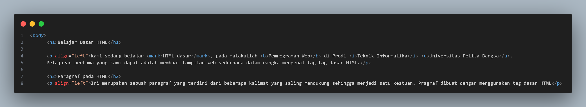

<br>

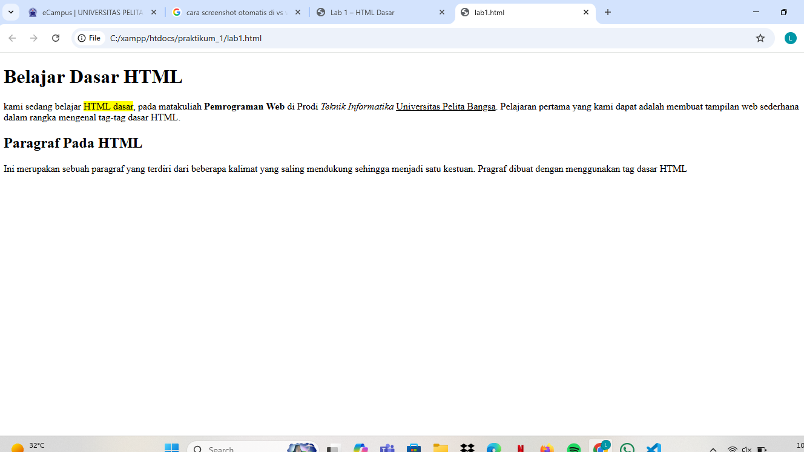

---

### 5️⃣ Menyisipkan Gambar

Simpan gambar pada folder yang sama, lalu tambahkan:

```html
<h3>Menambahkan Gambar</h3>

```

📸 **Screenshot Tampilan Gambar**

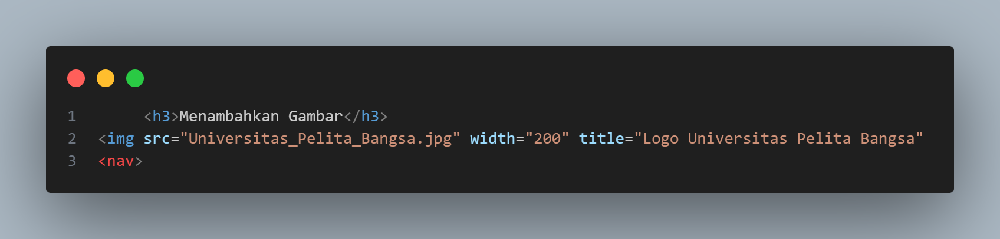
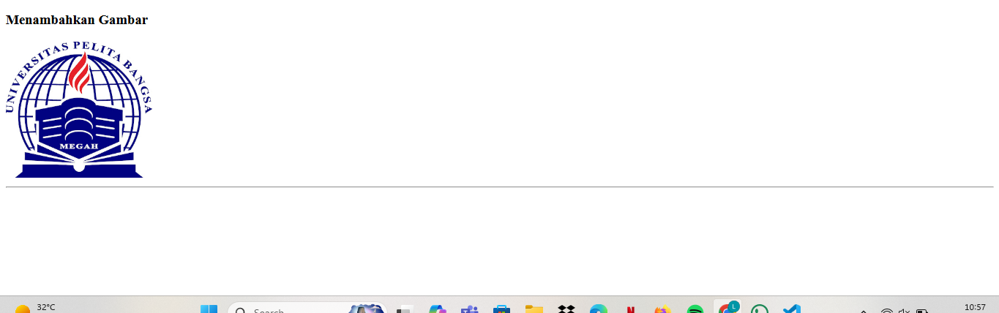

---

### 6️⃣ Menambahkan Hyperlink

Tambahkan link navigasi sebelum heading h1:

```html
<nav>
  <a href="lab1_tag_dasar.html">Dasar HTML</a>
  <a href="lab1_halaman2.html">Halaman 2</a>
  <a href="http://www.google.com" target="_blank"
    >Halaman Web Eksternal Google</a
  >
</nav>
<hr />
```

Buat file baru **`lab1_halaman2.html`** sebagai halaman kedua.

📸 **Screenshot Tampilan Hyperlink**

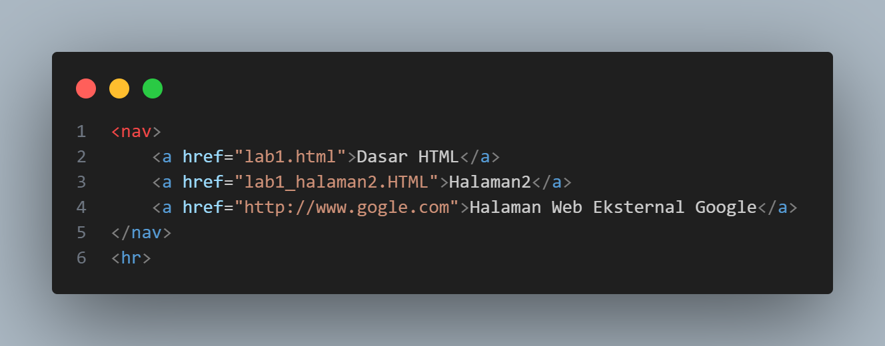
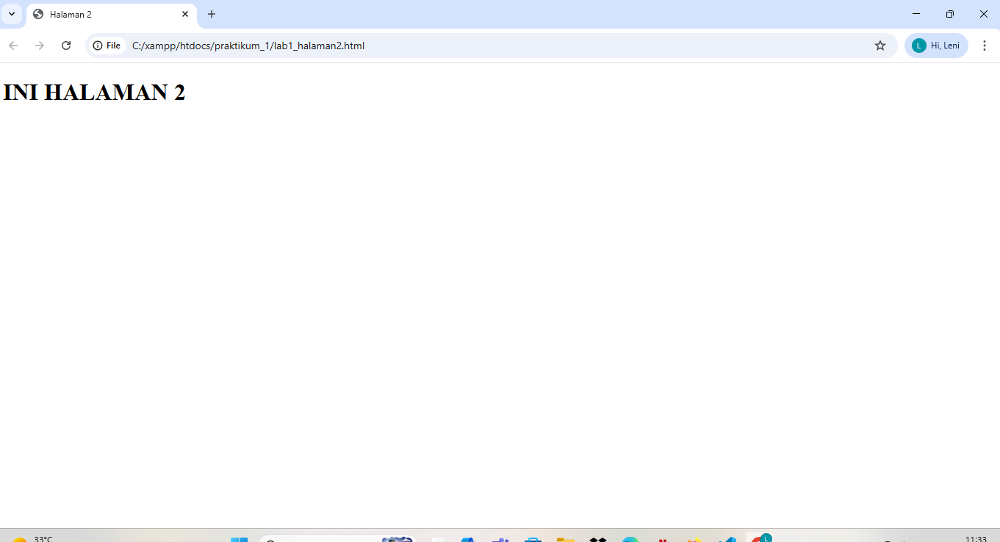
---

---
